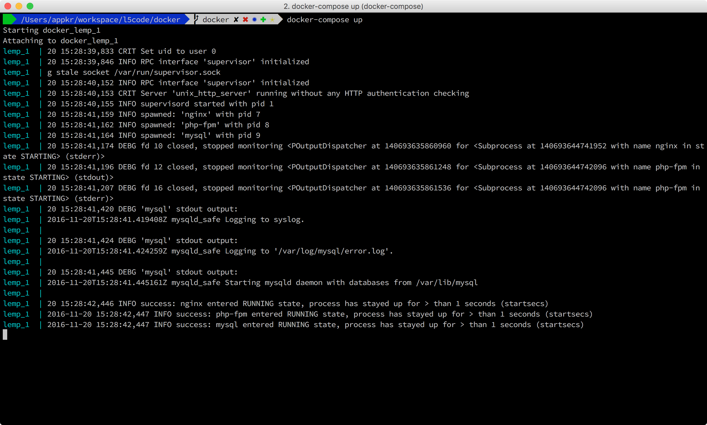
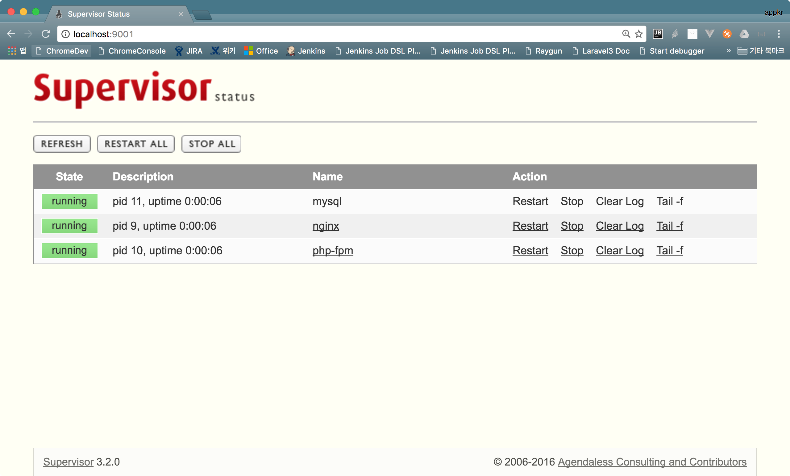

## Docker for L5Book

이 가이드는 로컬 개발 환경 설정에 어려움이 있는 분을들을 위한 것입니다. 

### 1. Docker 데몬 다운로드 및 설치

[Docker 홈페이지](https://www.docker.com/)를 방문하여 각자의 운영체제에 맞는 Docker 데몬을 다운로드 받아 설치합니다.

OSX에서는 홈브루로 설치할 수 있습니다.

```sh
$ brew tap caskroom/cask
$ brew cask install docker --appdir=/Application
```

Ubuntu에서는 apt-get으로 설치할 수 있습니다.

```sh
$ sudo apt-get update
$ sudo apt-get install docker.io
```

> Docker 데몬은 관리자 권한을 요구하므로, 설치 후 최초 한번 실행해서 운영체제 로그인 정보를 입력하여 권한을 부여해야 합니다.

### 2. 브랜치 이동

이 소스 코드를 다운로드 받았다면 `docker` 브랜치로 이동합니다.

```sh
~/myapp(master) $ git checkout docker 
~/myapp(docker) $ git branch
# * docker
#   master
```

소소코드를 다운로드 받지 않았다면, 다음 명령으로 4개의 파일을 다운로드 받습니다.
 
```sh
~/myapp $ wget https://raw.githubusercontent.com/appkr/l5code/docker/docker/docker-compose.yml
~/myapp $ wget https://raw.githubusercontent.com/appkr/l5code/docker/docker/Dockerfile
~/myapp $ wget https://raw.githubusercontent.com/appkr/l5code/docker/docker/myapp.conf
~/myapp $ wget https://raw.githubusercontent.com/appkr/l5code/docker/docker/myinit.sh
```

### 3. 이미지 빌드

`docker-compose` 명령을 이용할텐데, 이 명령은 길고 복잡한 옵션 파라미터들을 미리 정의해서 `docker`를 좀 더 편리하게 사용할 수 있도록 도와줍니다. 이 명령은 `docker-compose.yml`에 미리 작성된 옵션들을 참조합니다. 파일 안에 각 옵션에 대한 주석을 달아 두었습니다.

Docker "이미지"는 서버 인프라에 대한 스냅샷입니다. Docker "컨테이너"는 이미지를 실행한 상태를 말합니다 (정확한 표현은 아닙니다). 이 절에서 이미지를 만들겁니다. 

```sh
~/myapp(docker) $ cd docker
~/myapp/docker(docker) $ docker-compose build   # 이미지를 빌드합니다.
# ...
~/myapp/docker(docker) $ docker images          # 빌드된 이미지를 확인합니다.
# REPOSITORY       TAG     IMAGE ID      CREATED             SIZE
# docker_lemp      latest  be090cf065f3  53 minutes ago      609.2 MB
# appkr/lemp-base  latest  bb59765126dc  About an hour ago   609.2 MB
# ubuntu           16.04   e4415b714b62  3 days ago          128.1 MB
```

`docker_lemp` 이미지가 `appkr/lemp-base` 이미지에 의존하고, 얘는 다시 `ubuntu` 이미지에 의존합니다. Docker 이미지는 자신의 부모 이미지 대비 증분만 가지고 있기 때문에, 사용한 하드디스크 공간은 1,346MB가 아니라 609MB 입니다.

### 4. 컨테이너 실행

컨테이너를 실행하기 전에 꼭 이해해야할 내용은 볼륨 마운트입니다. 폴더 공유라 생각하면 됩니다. 호스트 머신에 있는 우리의 소스 코드 및 실습 중에 변경한 MySQL 데이터는 호스트와 Docker 컨테이너간에 공유되어야 합니다. "호스트" 머신은 내 로컬 컴퓨터를 의미합니다.

```sh
~/myapp/docker(docker) $ mkdir mysql_datadir    # MySQL 데이터를 공유할 폴더를 만듭니다. 
~/myapp/docker(docker) $ docker-compose up      # 만든 이미지를 실행합니다.
# ...
# 종료하려면 Ctrl+c를 누릅니다.
```

이 이미지는 포그라운드에서 실행하면서, Nginx, PHP, MySQL 로그를 화면에 출력하도록 구성되어 있습니다. 최초 실행했을 때 데이터베이스 초기화 등으로 인해 화면에 경고 또는 오류 메시지가 잔뜩 찍힐 수 있습니다.



> 혹시 라라벨 Valet 서버등 로컬 웹 서버가 구동 중이라 오류가 떨어진다면 로컬 웹 서버를 끄고 재시도해 주세요.

### 5. 초기 설정

`myapp` 데이터베이스와 `homestead` 사용자를 만들고, 최초 마이그레이션과 데이터 시딩을 할 차례입니다. 4절에서 만든 MySQL 데이터 공유 폴더의 내용을 지우지 않는다면, 이 작업은 다시 수행할 필요가 없습니다.

```sh
~/myapp(docker) $ docker ps                   # 실행 중인 컨테이너 목록을 확인합니다.
# CONTAINER ID    IMAGE        COMMAND           CREATED  STATUS  PORTS  NAMES
# <container_id>  docker_lemp  "/entrypoint.sh"  3 min..  Up 3..  0.0.0  docker_lemp_1

~/myapp(docker) $ docker exec -it <container_id> bash
                                      # 목록에서 얻은 <container_id>를 이용해서 컨테이너 안으로 들어갑니다.
                                      # 서버에 로그인했다고 생각하면 됩니다.

root@<container_id>:/var/www/myapp# bash docker/myinit.sh
root@<container_id>:/var/www/myapp# exit
                                      # 초기화 작업을 수행하고 컨테이너를 빠져 나옵니다.

~/myapp(docker) $
```

### 6. 테스트

(선택사항) 호스트 컴퓨터의 호스트 레코드가 추가되어있는지 확인합니다. 호스트 레코드를 추가하지 않고 `localhost`를 이용해도 됩니다.

```sh
# /etc/hosts

127.0.0.1   myapp.dev
```

- `http://myapp.dev:8000` 을 열어 봅니다. 호스트 레코드를 추가하지 않았다면 `http://localhost:8000` 을 엽니다. `docker-compose.yml`을 변경했다면, 변경 내용에 맞는 포트를 사용해야 합니다.
- MySQL 클라이언트에서 `127.0.0.1`, `33060` 포트로 접속해 봅니다. `root`, `homestead` 사용자의 비밀번호는 `secret`입니다. `docker-compose.yml`을 변경했다면, 변경 내용에 맞는 포트를 사용해야 합니다.
- `http://localhost:9001` 에서 Supervisor의 대시보드를 확인할 수 있습니다. 혹시 MySQL에 Fail이 떠 있다면, `docker-compose up`을 다시 실행하면 정상 상태로 표시됩니다. Fail이라 표시되어 있을 때도 MySQL 서비스는 정상 동작 상태일 가능성이 높습니다.


